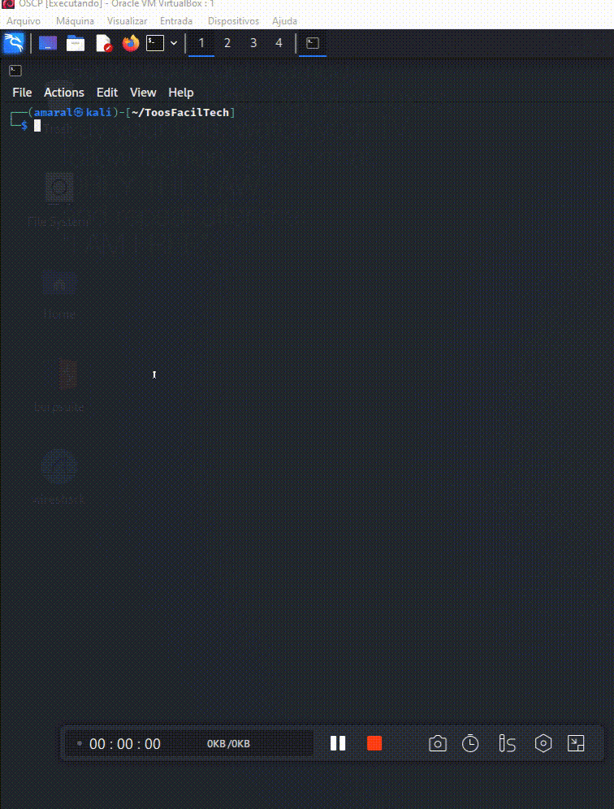

<!-- AUTO-GENERATED-CONTENT:START (STARTER) -->
<p align="center">
  <a href="https://www.faciltech.info">
    
  </a>
</p>
<h1 align="center">
  Search Nmap - Entender melhor os scripts do nmap
</h1>

A ideia nesse script simples é utilizando o próprio nmap, descobrir de forma simples, como os seus scripts funcionam.
## 🚀 Por que usa-lo?

Muitas vezes precisamos de um script para um determinado serviço, e diantes de centenas de opções, muitas vezes escolhemos uma determinada opção, em que este nem sempre trás o resultado esperado, muitas vezes porque necessitava de algum argumento, então para facilitar o entendimento do script, sem necessidade de ler o código fonte, resolvi facilitar minha vida criando este processo automatizado. 
  
1.  **Como instalar?**

    Navegue dentro de seu sistema, escolha o local e execute no terminal o comando abaixo.

    ``` git clone https://github.com/faciltech/search-nmap.git
        Cloning into 'search-nmap'...
        remote: Enumerating objects: 10, done.
        remote: Counting objects: 100% (10/10), done.
        remote: Compressing objects: 100% (10/10), done.
        remote: Total 10 (delta 1), reused 0 (delta 0), pack-reused 0
        Receiving objects: 100% (10/10), 19.14 KiB | 612.00 KiB/s, done.
        Resolving deltas: 100% (1/1), done.
      ```

2.  **Conceda permissão para o arquivo!**
```
chmod +x findFTP.py
```

## 🧐 Como usar o script?

Você irá digitar ```./findFTP.py``` 
  

## 🎓 Linguagem

O utilitário é desenvolvido em linguagem shellscript, necessita que o nmap esteja instalado na maquina.

<!-- AUTO-GENERATED-CONTENT:END -->


